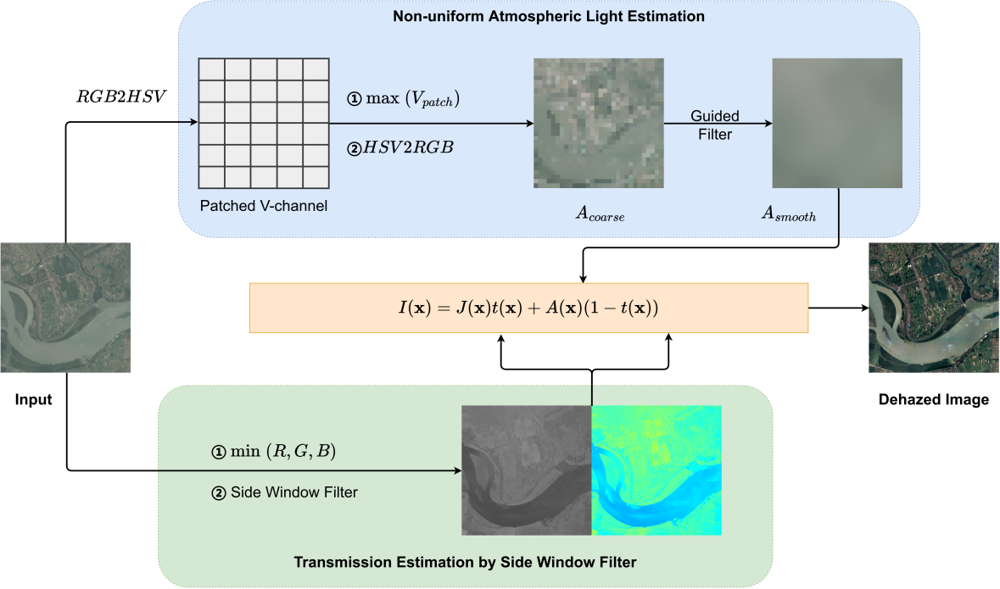

# HALP
the official repository of the paper "**Remote Sensing Image Dehazing using Heterogeneous Atmospheric Light Prior**"

Remote sensing images (RSIs) captured in haze weather will suffer from serious quality degradation with color distortion and contrast reduction, which creates numerous challenges for the utilization of RSIs. To address these issues, this paper proposes a novel haze removal algorithm, named HALP, for visible RSIs based on a heterogeneous atmospheric light prior and side window filter. HALP is comprised of two key components. Firstly, given the large imaging space of RSIs, the atmospheric light is treated as a globally non-uniform distribution instead of a global constant. Therefore, a simple and effective method for non-uniform atmospheric light estimation is presented, which utilizes the brightest pixel color in each local image patch as the atmospheric light of the local region. Secondly, a side window filter-based transmission estimation algorithm is proposed, which can effectively suppress the block effect in the transmission map caused by the large window of the minimum filter used in the dark channel algorithm. Experiments on both real-world and synthetic remote sensing haze images demonstrate the effectiveness of HALP. In terms of no-reference and full-reference image quality assessments, HALP yields excellent results, outperforming existing state-of-the-art algorithms, including physics-based and neural network-based methods. The visual comparison of dehazed results also shows that HALP can restore degraded RSIs with uneven haze, producing clear images with rich details and natural colors.

**The source code of the proposed HALP method will be released soon**...

## Dataset
1. For subjective evaluation and blind reference evaluation

    We constructed a Real-world Remote Sensing Haze Image Dataset (RRSHID), which consists of 277 haze-contaminated images manually selected from two classical remote sensing datasets, AID and DIOR. Details in folder "RRSHID".
2. For full-reference assessments

      - Haze1k: https://www.dropbox.com/s/k2i3p7puuwl2g59/Haze1k.zip?dl=0
      - DICE: https://pan.baidu.com/s/1h6SFWSnzH7GQJoM2UxO_ng

  

## Results

